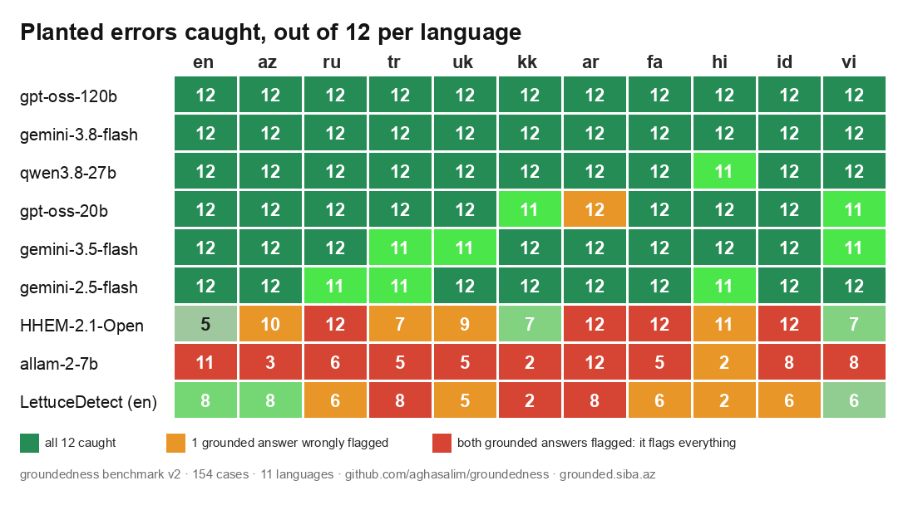

# groundedness

**Did the model make this up?** A claim-level groundedness check for LLM answers: one call, any OpenAI-compatible model, any language. Try it live, no key needed: **[grounded.siba.az](https://grounded.siba.az)** — it also hosts the public multilingual detector leaderboard.

```python
from groundedness import check

facts  = "Diş klinikası, Nizami küç. 12. B.e–Şənbə 9:00–19:00. Konsultasiya 30 AZN."
answer = "Salam! Konsultasiya 25 AZN-dir, bazar günü də işləyirik. Ünvan Nizami küçəsi 12."

r = check(answer, sources=[facts], model="qwen/qwen3.8-27b")
r.unsupported  # ['Konsultasiya 25 AZN-dir', 'bazar günü də işləyirik']
r.fixed        # 'Salam! Konsultasiya haqqı və bazar günü işləyib-işləmədiyimiz haqqında məlumatım yoxdur. Ünvan Nizami küçəsi 12-dir.'
r.score        # 0.47
```

That is Azerbaijani. It works the same in Russian, Turkish, Arabic or English, because the judge reads the answer in its own language. Every trained hallucination detector published so far — Vectara HHEM, LettuceDetect, Patronus Lynx — is English-only.

## Why

RAG apps and support bots answer from documents. The failure that hurts is not a looping decode or a made-up historical date; it is *"a consultation is 25 AZN"* when the document says 30. `groundedness` finds that sentence, names it, and gives you the answer without it.

- **Any model.** Groq, OpenAI, Ollama, vLLM, OpenRouter — anything that speaks `/chat/completions`. No model to download, no GPU.
- **Any language.** No training data, no language list. If the model can read it, the judge can check it.
- **Claim-level output.** Not a score you cannot act on: the exact unsupported claims, and a rewrite. Highlight them, hand off to a human, or log the rate.
- **Zero dependencies.** `urllib` and `json`. Python 3.9+.

## Install

```
pip install groundedness
```

Set `OPENAI_BASE_URL` and `OPENAI_API_KEY`, or just `GROQ_API_KEY` (Groq's endpoint is the default when it is set). Or pass `base_url=` / `api_key=` to `check()`.

## CLI

```
echo "the answer" | groundedness --model qwen/qwen3.8-27b --sources facts.txt policy.md
```

Prints JSON: `grounded`, `score`, `unsupported`, `fixed`.

## What it is not

It checks an answer against **the sources you give it**, not against the world. A true claim that is not in your documents is reported as unsupported — which is what you want from a bot that must only say what the owner wrote. It is a judge call, so it costs one short completion per answer (about 350 tokens on the example above) and it is as good as the model judging; the tests use `qwen/qwen3.8-27b` on Groq, which caught every planted error in az/ru/en.

## Tests

```
GROQ_API_KEY=... python -m pytest -q
```

Three languages, one planted wrong price and one invented opening day each; plus a grounded answer that must come back unchanged.

## Benchmark v2: judges vs the English-trained detectors, eleven languages

Two domains (a dental clinic, an electronics shop), eleven languages across five scripts, and for each a grounded answer plus seven single-error variants planted by slot substitution — wrong price, wrong hours, wrong street number, one phone digit changed, wrong return window, an invented Sunday opening, an added claim. **154 answers, 132 of them wrong**, identical across languages. Full tables: [`benchmark/results_v2.md`](benchmark/results_v2.md), [`results_v2-gemini.md`](benchmark/results_v2-gemini.md), [`results_v2-baselines.md`](benchmark/results_v2-baselines.md). Paper: [`paper/groundedness-eleven-languages-v2.pdf`](paper/groundedness-eleven-languages-v2.pdf). Live leaderboard: [grounded.siba.az](https://grounded.siba.az/#leaderboard).



| Detector | Kind | Errors caught | False alarms | Median latency |
|---|---|---:|---:|---:|
| `openai/gpt-oss-120b` | LLM judge, Groq | **132/132** | **0/22** | 0.70 s |
| `gemini-3.8-flash` | LLM judge, Google | **132/132** | **0/22** | 2.88 s |
| `qwen/qwen3.8-27b` | LLM judge, Groq | 131/132 | 0/22 | **0.36 s** |
| `openai/gpt-oss-20b` | LLM judge, Groq | 130/132 | 1/22 | 0.45 s |
| `gemini-3.5-flash` | LLM judge, Google | 129/132 | 0/22 | 5.05 s |
| `gemini-2.5-flash` | LLM judge, Google | 129/132 | 0/22 | 5.54 s |
| `vectara/HHEM-2.1-Open` | trained classifier, CPU | 104/132 | **12/22** | 0.05 s |
| `allam-2-7b` | LLM judge, Groq | 67/132 | 21/22 | 0.32 s |
| `LettuceDetect-base (en)` | trained classifier, CPU | 65/132 | 11/22 | 0.06 s |

Three things the tables show:

- **The judge approach transfers; the trained detectors do not.** Two open models are perfect in all eleven languages, and a 27B model misses one case in 0.36 s.
- **HHEM's 79 % is a language detector, not a hallucination detector.** In English it catches 5/12 with no false alarms. In Russian, Arabic, Persian and Indonesian it catches 12/12 *and flags both grounded answers*: its consistency score for any non-English pair sits under the threshold whatever the content. Recall without the false-alarm column is meaningless.
- **LettuceDetect follows script distance**: 8/12 in the Latin-script languages, 6/12 in Russian, 2/12 in Kazakh and Hindi, with false alarms in eight languages. Where it works it names spans and costs 0.06 s on a CPU, which is its real advantage.

Among the judges, the single changed phone digit and the wrong hours cause nearly all the misses. A 7B model (allam) over-flags and misses in every language including English: below roughly 20B parameters this is not a judge.

Two measurement bugs were caught before publishing and are documented in the paper: an empty reply from a thinking model was scored as "grounded" (fixed in 0.1.1), and HHEM's score was first treated as a span and required to overlap the planted text, giving 0/132 (rescored from the saved raw outputs).

### v1 (smoke test, 33 answers per model)

Kept in [`benchmark/RESULTS.md`](benchmark/RESULTS.md) and [`gemini.md`](benchmark/gemini.md): seven of nine models perfect on the one-domain, two-error set.

## Roadmap

- Harder errors that will lower every row: a right number in the wrong sentence, a claim implied but not stated, an omitted condition, a meaning-changing paraphrase.
- Native-speaker review of the nine non-native case sets (PRs welcome: one JSON entry per language).
- More providers: the runner takes any OpenAI-compatible endpoint (`--openrouter` is wired, unfunded).
- A DeepEval / RAGAS metric that wraps this.

## Origin

Extracted from the groundedness judge that runs on every channel of [SIBA](https://siba.az)'s assistant. MIT.
