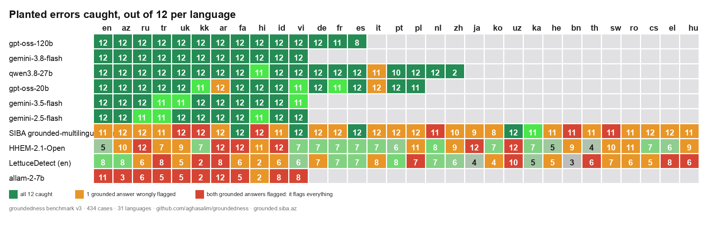

# groundedness

[](https://doi.org/10.5281/zenodo.23003649)

Did the model make this up? I wrote this to check LLM answers claim by claim against the sources they were given. It's a single call, it works with any OpenAI-compatible model, and the answer can be in any language. You can try it live without a key at **[grounded.siba.az](https://grounded.siba.az)**. That site also hosts the public multilingual detector leaderboard.

```python
from groundedness import check

facts  = "Diş klinikası, Nizami küç. 12. B.e–Şənbə 9:00–19:00. Konsultasiya 30 AZN."
answer = "Salam! Konsultasiya 25 AZN-dir, bazar günü də işləyirik. Ünvan Nizami küçəsi 12."

r = check(answer, sources=[facts], model="qwen/qwen3.8-27b")
r.unsupported  # ['Konsultasiya 25 AZN-dir', 'bazar günü də işləyirik']
r.fixed        # 'Salam! Konsultasiya haqqı və bazar günü işləyib-işləmədiyimiz haqqında məlumatım yoxdur. Ünvan Nizami küçəsi 12-dir.'
r.score        # 0.47
```

That's Azerbaijani. It works the same way in Russian, Turkish, Arabic or English, since the judge reads the answer in its own language. Every trained hallucination detector published so far is English-only, including Vectara HHEM, LettuceDetect and Patronus Lynx.

## Why

RAG apps and support bots answer from documents. The failures I care about are small ones, like a bot saying *"a consultation is 25 AZN"* when the document says 30. Looping decodes and made-up historical dates are a different problem. `groundedness` points at that sentence and hands you back the answer with it taken out.

It works with anything that speaks `/chat/completions`, so Groq, OpenAI, Ollama, vLLM and OpenRouter are all fine. There's no model to download and you don't need a GPU.

There's no training data or language list either. If the model can read the text, the judge can check it.

Instead of a bare score you can't act on, you get the exact claims that aren't supported, plus a rewrite. You might highlight them or hand the answer off to a human. Logging the rate works too.

It has no dependencies beyond `urllib` and `json`, and it needs Python 3.9+.

## No key at all: the hosted detector

```python
r = check(answer, sources=[facts], model="siba")      # grounded.siba.az, exact spans, free
r = check(answer, sources=[facts], model="cascade")   # detector first; an LLM judge + rewrite only if it flags something
```

With `model="siba"` it calls our own multilingual detector, `siba/grounded-multilingual-base`. It's an XLM-RoBERTa token classifier. It was trained on 2,844 synthetic labelled answers in 30 languages, plus RAGTruth. It's served from a Raspberry Pi 5 in Baku. Benchmark v3 has 31 languages and 434 cases. On it the detector catches **352/372 planted errors (95 %)**. It raises 32/62 false alarms and takes ~30 ms on a laptop CPU. On the same cases HHEM-2.1-Open catches 265/372, with 22/62 false alarms. You don't need an API key, but you don't get a rewrite either. It only marks the spans, so use an LLM judge when you also want the corrected answer. The weights are at [huggingface.co/aghasalim/grounded-multilingual-base](https://huggingface.co/aghasalim/grounded-multilingual-base). The recipe is in `train/` and paper v3 is in `paper/`.

## Install

```
pip install groundedness
```

Set `OPENAI_BASE_URL` and `OPENAI_API_KEY`, or just `GROQ_API_KEY`. If that one's set, Groq's endpoint is the default. You can also pass `base_url=` / `api_key=` to `check()`.

## CLI

```
echo "the answer" | groundedness --model qwen/qwen3.8-27b --sources facts.txt policy.md
```

It prints JSON with `grounded`, `judged`, `score`, `unsupported` and `fixed`. If the judge's reply can't be used, `judged` is false and `score` is null.

## What it is not

It only checks an answer against the sources you give it. It knows nothing about the world. So a true claim that isn't in your documents gets reported as unsupported. That's what you want from a bot that should only say what the owner wrote. Each check is a judge call, so it costs one short completion per answer. On the example above that's about 350 tokens. It's also only as good as the model doing the judging. The tests use `qwen/qwen3.8-27b` on Groq, and it caught every planted error in az/ru/en.

## Tests

```
GROQ_API_KEY=... python -m pytest -q
```

There are three languages, each with one planted wrong price and one invented opening day. There's also a grounded answer that has to come back unchanged.

## Benchmark v3: our detector vs judges vs the English-trained detectors, 31 languages

The full tables are in [`benchmark/results_v3-siba.json`](benchmark/results_v3-siba.json), [`results_v3.md`](benchmark/results_v3.md) and [`results_v3-baselines.md`](benchmark/results_v3-baselines.md). The paper is [`paper/groundedness-multilingual-detector-v3.pdf`](paper/groundedness-multilingual-detector-v3.pdf), and the live leaderboard is at [grounded.siba.az](https://grounded.siba.az/#leaderboard).

| Detector | Kind | Languages | Errors caught | False alarms | Latency |
|---|---|---:|---:|---:|---:|
| `siba/grounded-multilingual-base` (ours) | trained classifier, Raspberry Pi | 31 | **352/372 (95 %)** | 32/62 | 0.03 s |
| `vectara/HHEM-2.1-Open` | trained classifier | 31 | 265/372 (71 %) | 22/62 | 0.04 s |
| `KRLabsOrg/lettucedect-base-modernbert-en-v1` | trained classifier | 31 | 191/372 (51 %) | 28/62 | 0.05 s |
| `openai/gpt-oss-120b` | LLM judge, Groq | 14 | 163/163 | 0/28 | 0.70 s |
| `qwen/qwen3.8-27b` | LLM judge, Groq | 19+ | 214/215 | 1/36 | 0.34 s |
| `openai/gpt-oss-20b` | LLM judge, Groq | 17 | 200/203 | 2/34 | 0.44 s |

The judges only cover as many languages as the free daily quota allowed on 2026-09-20. I'll fill in the remaining rows as it resets. Our detector's false alarms are all paraphrases of the source, like "Monday to Saturday" for "Mon-Sat". Fixing that is the first item of future work.



## Benchmark v2: judges vs the English-trained detectors, eleven languages

I used two domains, a dental clinic and an electronics shop, in eleven languages across five scripts. Each one has a grounded answer plus seven variants, and I planted a single error in each variant by slot substitution. The errors are a wrong price, wrong hours, a wrong street number, one changed phone digit, a wrong return window, an invented Sunday opening and an added claim. That makes 154 answers, and 132 of them are wrong. They're identical across languages. The full tables are in [`benchmark/results_v2.md`](benchmark/results_v2.md), [`results_v2-gemini.md`](benchmark/results_v2-gemini.md) and [`results_v2-baselines.md`](benchmark/results_v2-baselines.md). The paper is [`paper/groundedness-eleven-languages-v2.pdf`](paper/groundedness-eleven-languages-v2.pdf), and the live leaderboard is at [grounded.siba.az](https://grounded.siba.az/#leaderboard).


| Detector | Kind | Errors caught | False alarms | Median latency |
|---|---|---:|---:|---:|
| `openai/gpt-oss-120b` | LLM judge, Groq | **132/132** | **0/22** | 0.70 s |
| `gemini-3.8-flash` | LLM judge, Google | **132/132** | **0/22** | 2.88 s |
| `qwen/qwen3.8-27b` | LLM judge, Groq | 131/132 | 0/22 | **0.36 s** |
| `openai/gpt-oss-20b` | LLM judge, Groq | 130/132 | 1/22 | 0.45 s |
| `gemini-3.5-flash` | LLM judge, Google | 129/132 | 0/22 | 5.05 s |
| `gemini-2.5-flash` | LLM judge, Google | 129/132 | 0/22 | 5.54 s |
| `vectara/HHEM-2.1-Open` | trained classifier, CPU | 104/132 | **12/22** | 0.05 s |
| `allam-2-7b` | LLM judge, Groq | 67/132 | 21/22 | 0.32 s |
| `LettuceDetect-base (en)` | trained classifier, CPU | 65/132 | 11/22 | 0.06 s |

Here's what I took from the tables.

- The judge approach carries over to other languages and the trained detectors don't. Two open models are perfect in all eleven languages. A 27B model misses one case, in 0.36 s.
- HHEM's 79 % mostly tells you which language the text is in. In English it catches 5/12 with no false alarms. In Russian, Arabic, Persian and Indonesian it catches 12/12, but it also flags both grounded answers. Its consistency score for any non-English pair sits under the threshold whatever the content says. So recall means nothing without the false-alarm column next to it.
- LettuceDetect gets worse as the script gets further from English. It catches 8/12 in the Latin-script languages and 6/12 in Russian. In Kazakh and Hindi it's down to 2/12, and it raises false alarms in eight languages. Where it does work, it names spans and costs 0.06 s on a CPU. That's its real advantage.

Among the judges, nearly all the misses come from the single changed phone digit and the wrong hours. A 7B model (allam) over-flags and misses in every language, English included. Below roughly 20B parameters a model just isn't usable as a judge here.

I caught two measurement bugs before publishing, and both are written up in the paper. First, an empty reply from a thinking model was scored as "grounded". That's fixed in 0.1.1. Second, I first treated HHEM's score as a span and required it to overlap the planted text, which gave 0/132. I rescored it from the saved raw outputs.

### v1 (smoke test, 33 answers per model)

The old results are kept in [`benchmark/RESULTS.md`](benchmark/RESULTS.md) and [`gemini.md`](benchmark/gemini.md). Seven of nine models were perfect on the one-domain, two-error set.

## Roadmap

- Harder errors that will lower every row, like a right number in the wrong sentence, a claim that's implied but not stated, an omitted condition, or a paraphrase that changes the meaning.
- Native-speaker review of the nine non-native case sets. PRs are welcome, and it's one JSON entry per language.
- More providers. The runner already takes any OpenAI-compatible endpoint, and `--openrouter` is wired up but unfunded.
- A DeepEval / RAGAS metric that wraps this.

## Origin

I pulled this out of the groundedness judge that runs on every channel of [SIBA](https://siba.az)'s assistant. MIT.
